#### [Back to main page](./)

## Analysis of data presented on endcoronavirus.org 
Based on [https://www.endcoronavirus.org/countries](https://www.endcoronavirus.org/countries).

### Our method
We have taken into account another metrics connected to active cases and deaths to see how European countries tackle COVID-19.
We have also normalised data per million inhabitants and kept same y-axis for all countries.
We have followed endcoronavirus.org countries grouping. In green - 'winning', in orange 'nearly there' and in red - 'need action'.

### What we have noticed

#### From data per million

Some of the green countries are very small. Like Andorra, which tackles COVID-19 great:
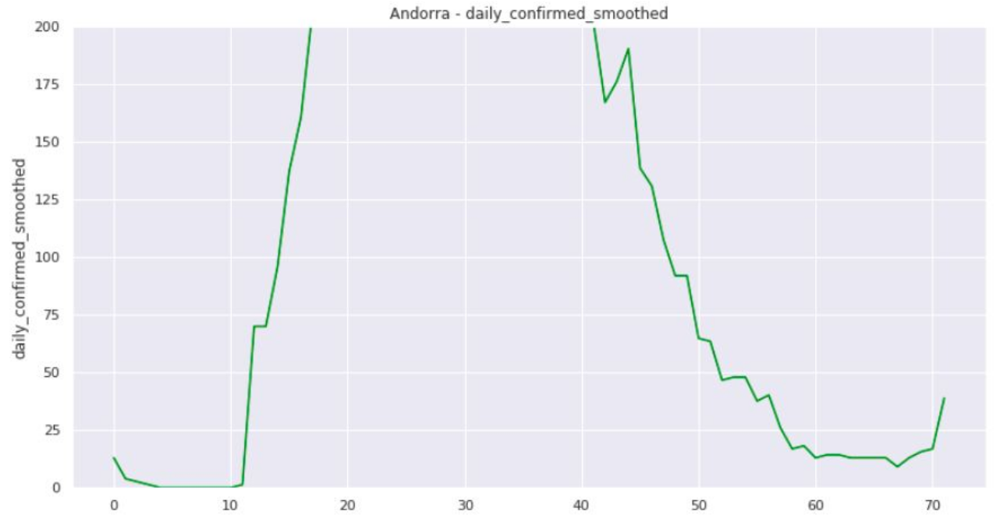
Other similar countries are Iceland, Liechtenstein, Luxembourg, Malta and Monaco.

Some green countries on our normalised data looks good. Like Austria:
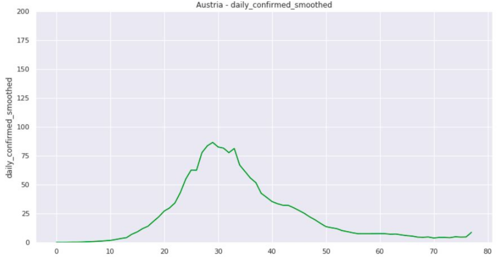

Of course there are some countries mentioned, ex. Bulgaria, which 'need action':
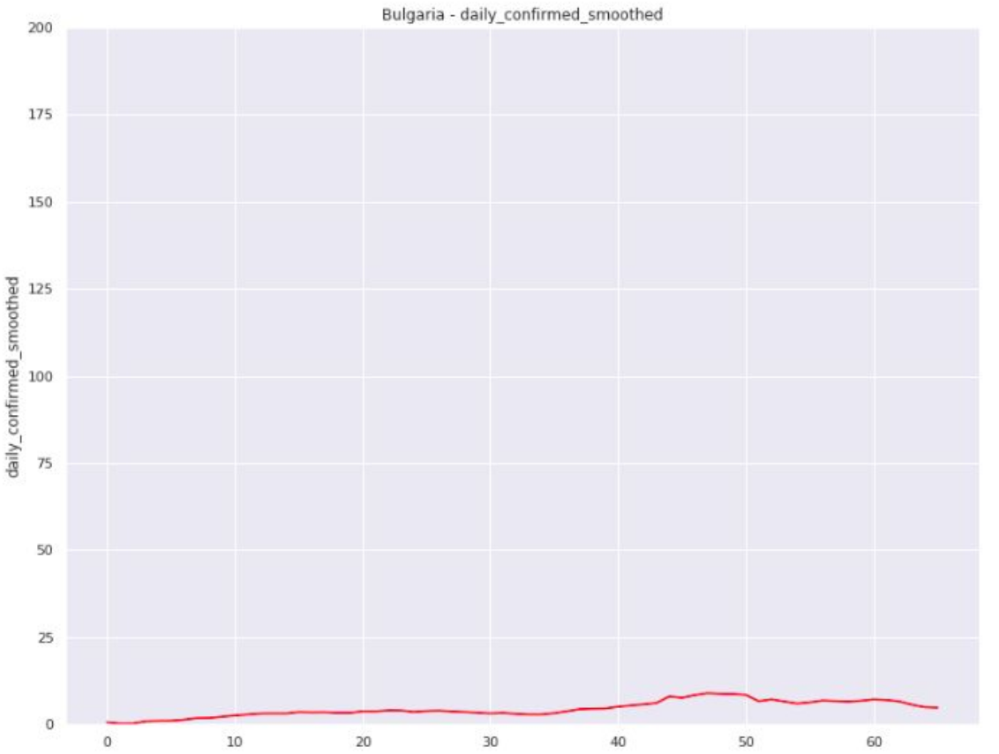
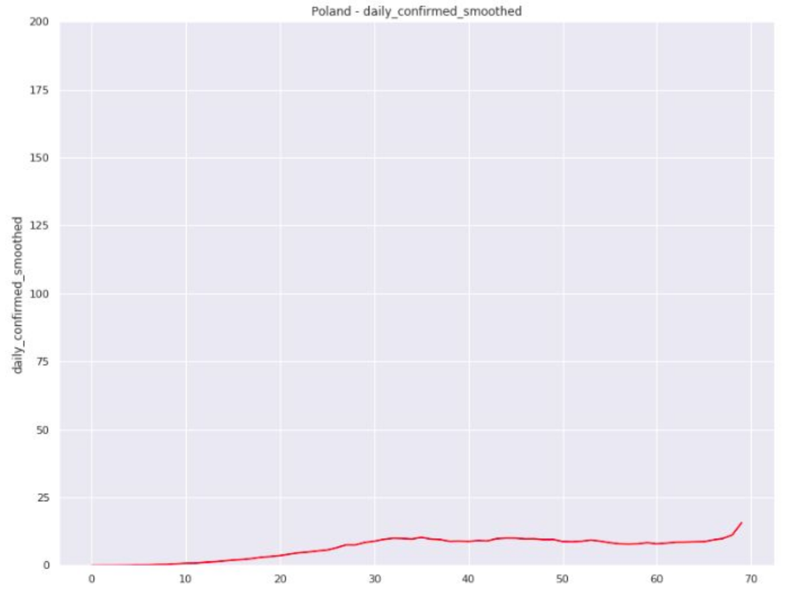
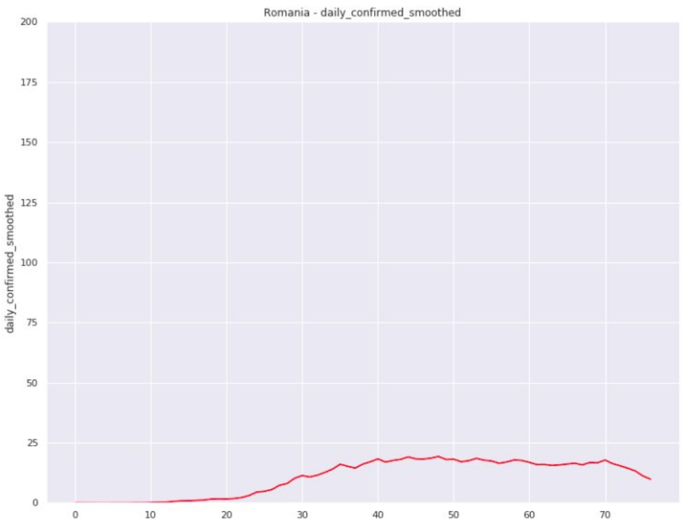
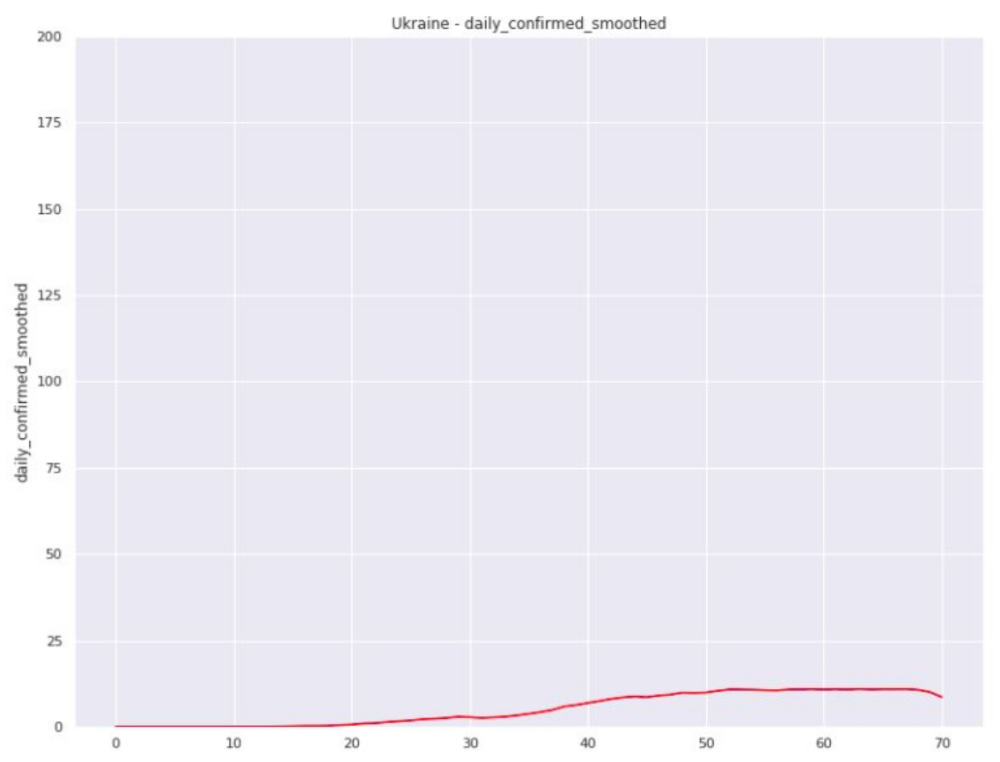
We see that in fact these countries have relatively small number of new cases per one million inhabitants.

#### From active cases per million

One of countries in green group was Estonia, but in red Finland. Is that fair?
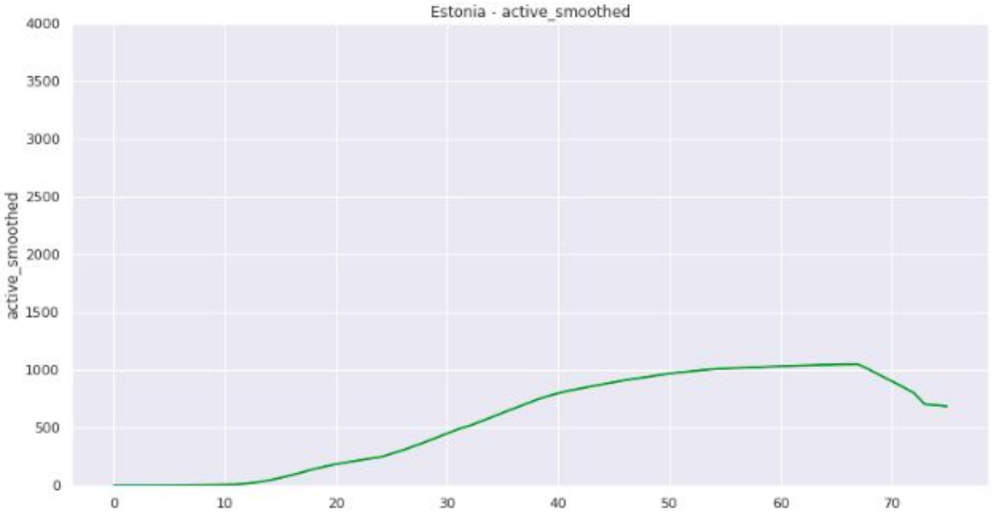
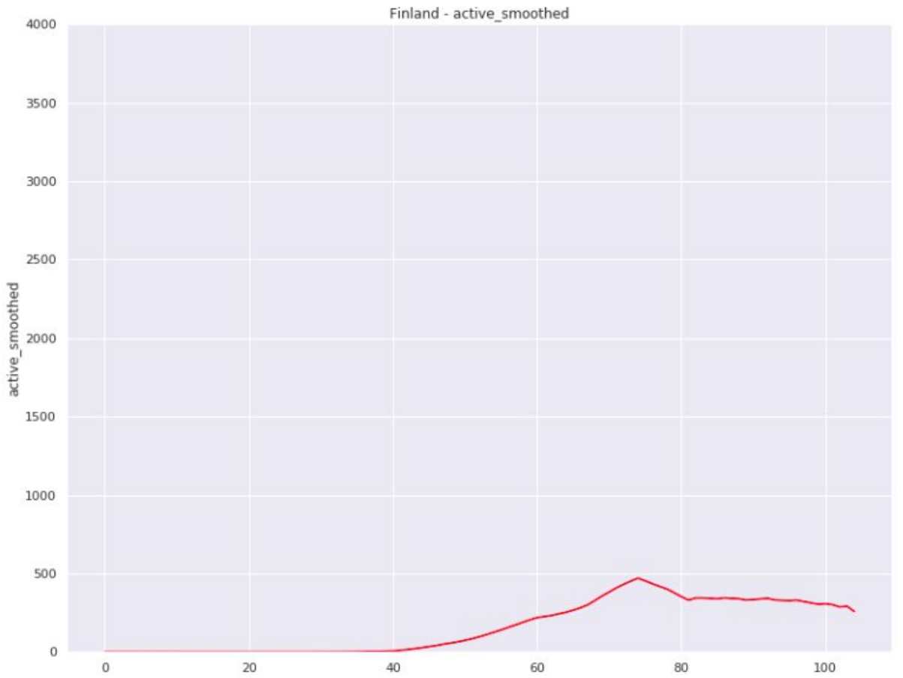
There are other countries like Finland - Bulgaria, Poland, Romania, Ukraine.

#### From percentage increase in deaths
In some previous analysis we were observing statistics against the same country, like percentage increase in deaths.
We see now, that it is very difficult to interpret.

Which country does have smaller deaths increase United Kingdom or Ukraine?
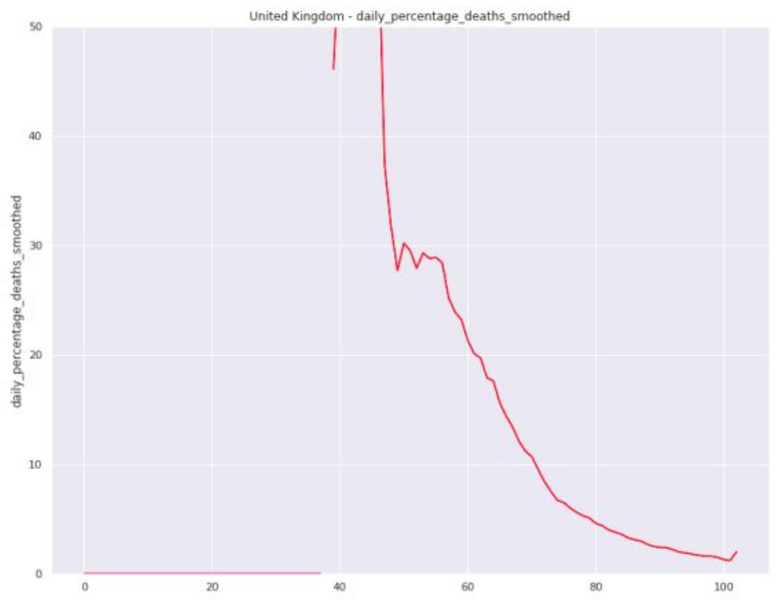
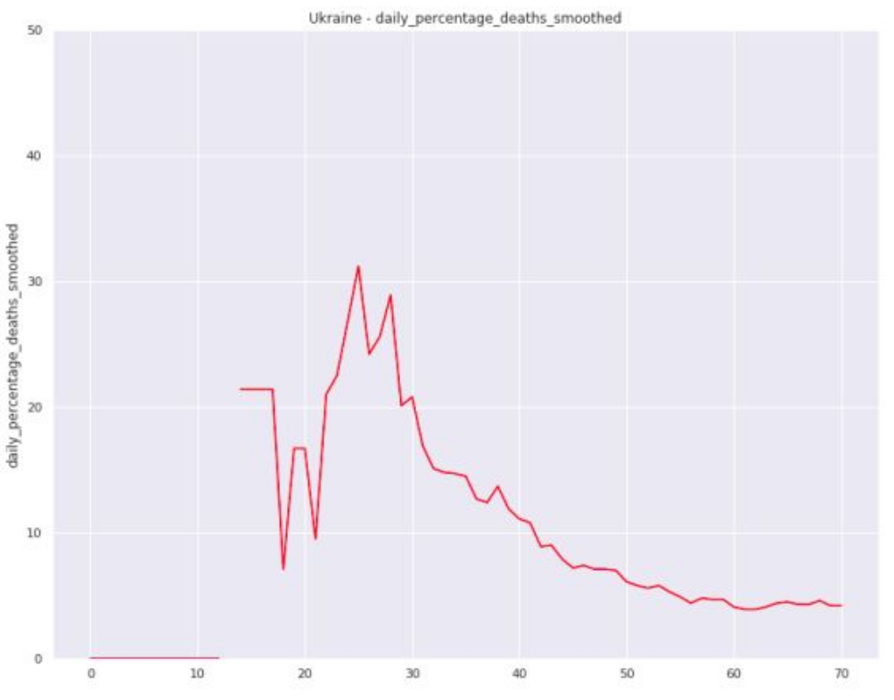
The longer duration of the pandemic and the faster growth at the beginning makes it look like the UK is currently in better control of the situation, but when we look at the numerical statistics, this is not the case.
Charts below show nuber of daily new deaths per million inhabitants, y-axis is in the same range for both countries.
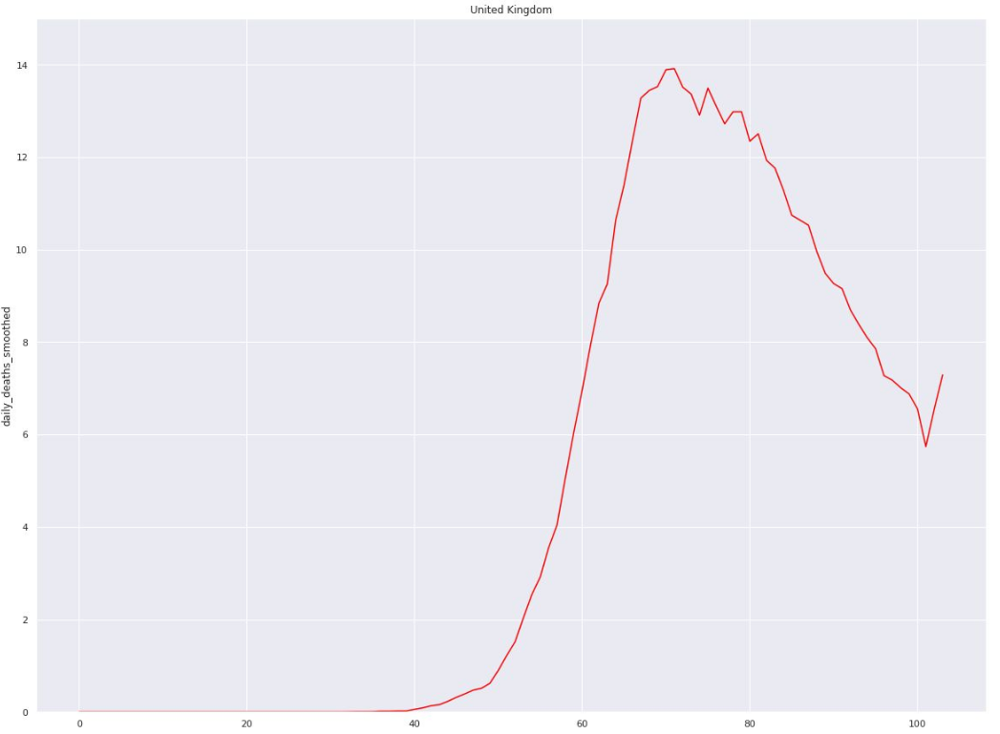
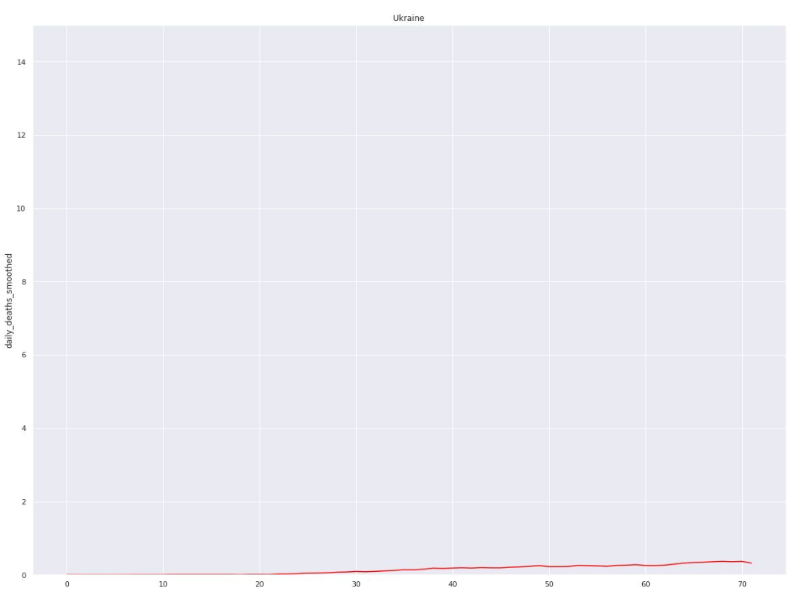

### Our charts
