## Motywacje

### Podstawowe problemy

* W związku z długim czasem inkubacji wirusa decyzje podejmowane przez rządy 
mogą mieć widoczny wpływ dopiero po kilku/kilkunastu dniach.
* Różna liczba zgonów w zależności od etapu pandemii 
- liczba ciężkich przypadków najbardziej wpływa na śmiertelność.
* Wpływ temperatury powietrza na żywotność wirusa.
* Podejmowane działania są od siebie zależne i mogą mieć wpływ na siebie nawzajem.
* Różna gęstość zaludnienia w różnych państwach / ich regionach.

### Wpływ decyzji rządowych na rozwój pandemii

#### Postawione pytania

* Które decyzje rządowe są istotne?
* Czy np. decyzja o zamykaniu ludzi w domach ma rzeczywisty wpływ na ograniczenie się rozprzestrzeniania się koronawirusa?
* Czy działania podejmowane przez rządy mają jakikolwiek wpływ?
* Czy istnieją podobieństwa w przebiegu pandemii pomiędzy państwami na podstawie podejmowanych działań rządowych?
* Czy da się wyznaczyć grupy krajów, które podobnie radzą sobie z epidemią, a wcześniej wprowadzały ograniczenia?

**Badania zostały wykonane dla krajów europejskich, dokładny zakres państw zmieniał się dla poszczególnych analiz.**

#### Wybrane decyzje rządowe

* Zamknięcie wszystkich **granic** (m.in. odwołanie lotów).
* Odwołanie zajęć w **szkołach**.
* Zakaz wychodzenia z **domu** (ew. znaczne ograniczenia dot. przemieszczania się).
* Nakaz noszenia **maseczek**.

#### Istotne problemy w ujednoliceniu decyzji dla wszystkich państw

* Wybór momentu kiedy dana decyzja została wprowadzona - niektóre kraje wprowadzały obostrzenia stopniowo
np. zamknięcie najpierw uczelni, potem szkół średnich, a na końcu podstawówek i przedszkoli.
* Ograniczenia wprowadzone tylko częściowo.
* Brak wprowadzenia jakichkolwiek ograniczeń.
* Nie zostało uwzględnione wycofywanie się z obostrzeń, tzw. odmrażanie gospodarki.

#### Idea
**Wydobycie ogólnych zależności poprzez pogrupowanie krajów, które podobnie przechodzą epidemię.**

##### Problemy
* Wybór cech do grupowania, znalezienie sposobu na analizę krzywej zachorowań.
* Ocena ważności decyzji rządowej dla grupowania.
* Jakie inne cechy charakterystyczne dla państw brać pod uwagę.

## Analiza wpływu decyzji rządowych - metoda ilościowa

### Wyznaczenie początku pandemii
Pierwszym ważnym problemem przy próbie wyznaczenia przebiegu epidemii w poszczególnych państwach
jest zdefiniowanie jej rozpoczęcia. Dynamika pandemii może być bowiem bardzo różna dla kilku pierwszych
przypadków. W niektórych państwach liczba zachorowań na poziomie od kilku do kilkunastu przypadków
mogła utrzymywać się przez relatywnie długi czas, po czym dopiero następował prawdziwy początek.
Aby analiza była rzetelna trzeba przyjąć odpowiednie kryterium początku epidemii, tak aby, jeżeli
dane kraje faktycznie przechodziły pandemię w podobny sposób, było możliwe zaobserwowanie tego.

Poniżej przedstawione zostały wykresy przedstawiające okresy odpowiednio 60 i 30 dni od pierwszego 
zachorowania jak również od 200 przypadku. Przedstawiają one fakt, że w zależności od wybranego początku
jak i okna czasowego, w którym dane są obserwowane, zależności między państwami znacząco się różnią.

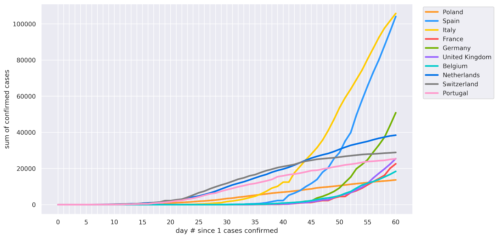

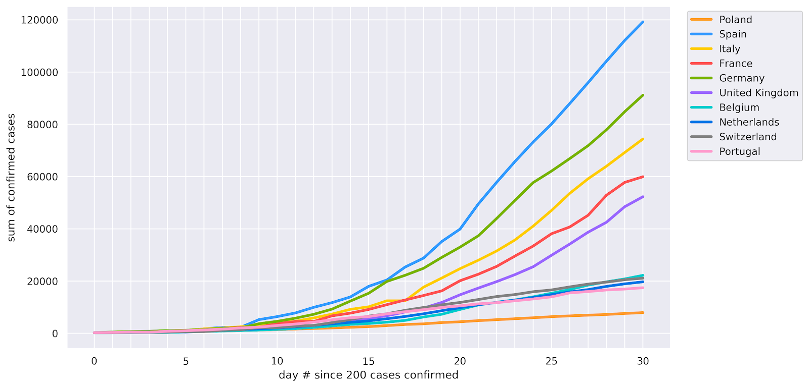

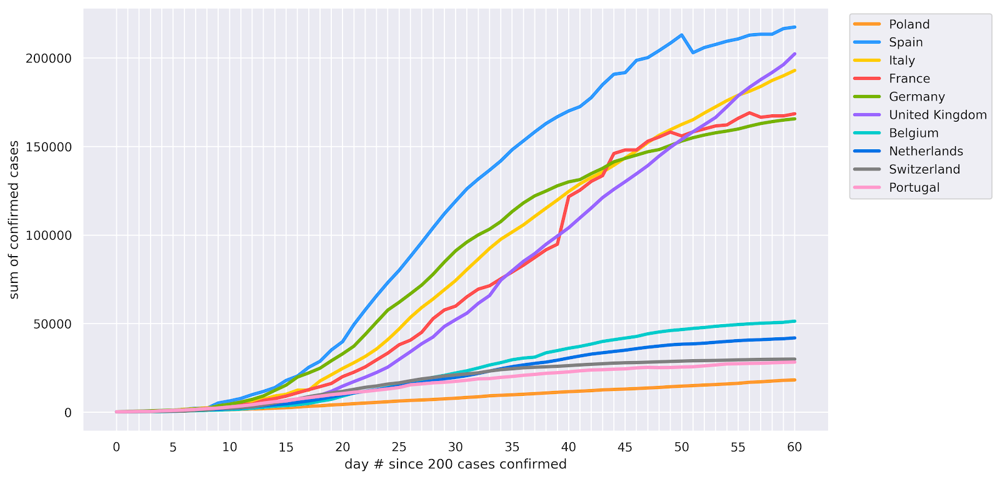

### Grupowanie manualne

Na podstawie powyższych wykresów, oraz naniesionych na oś czasu dat decyzji rządowych próbowano zaobserwować
pierwsze zależności oraz stworzyć manualnie grupy państw biorąc pod uwagę podobieństwo przebiegu.
Wykresy poniżej przedstawiają przykład takiego grupowania.

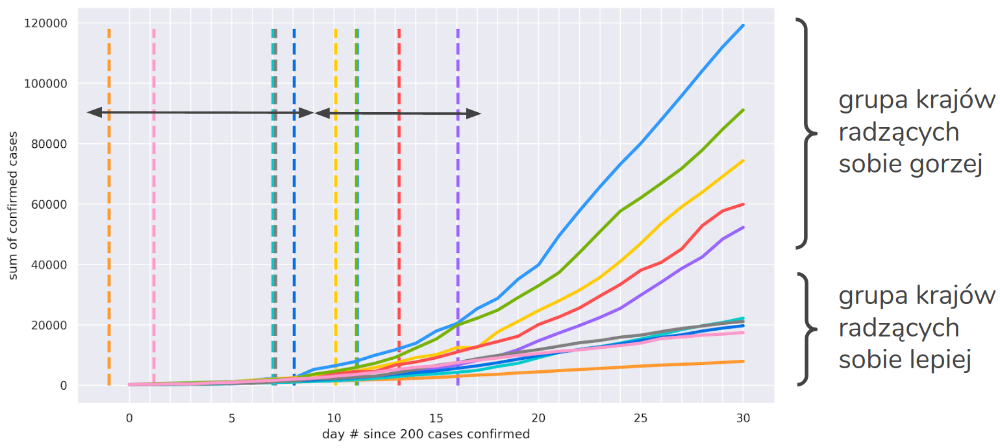

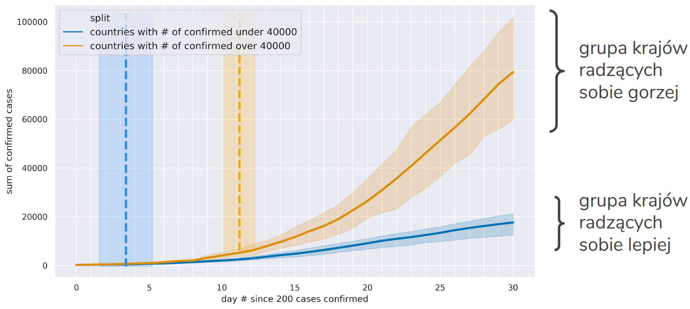

### Automatyzacja procesu grupowania

#### Schemat
Aby zbadaż wiele możliwości zdecydowano się zautomatyzować cały proces. W tym celu przedsięwzięto
następujące kroki:
1. Pozyskanie danych
    * zgromadzenie danych z wielu źródeł
    * zamiana danych na cechy numeryczne
2. Grupowanie
    * znalezienie grupowań (2, 3, 4 grupy) dla krajów na różnych etapach epidemii
    * metoda k-means
3. Wyszukiwanie cech
    * określenie, które cechy (określające dany kraj) są kluczowe
    * cechy objaśniające grupowanie

#### Zbiór cech

##### Cechy użyte do grupowania
**Liczba przypadków po *N* dniach od wykrycia *M* przypadków** 
Przykład: Jaka jest liczba zakażonych w poszczególnych krajach po **21 dniach**, zaczynając od dnia w którym potwierdzono **100 przypadek**.

##### Cechy charakteryzujące państwo
* Wielkość populacji
* Liczba testów 
* Gęstość zaludnienia
* Mediana wieku
* Współczynnik urbanizacji
* Indeks GHS (Global Health Security)
* Liczba dni, które upłynęły od wprowadzenia decyzji rządowej do potwierdzenia co najmniej ***M*** przypadków

#### Grupowanie K-means

Cechy:
* Jednowymiarowe wejćie
* Możliwa różna liczba klastrów - 2, 3 lub 4

Poniżej przedstawione zostały przykładowe wyniki dla 2, 3 oraz 4 klastrów kolejno:

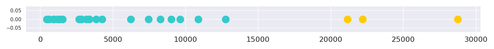

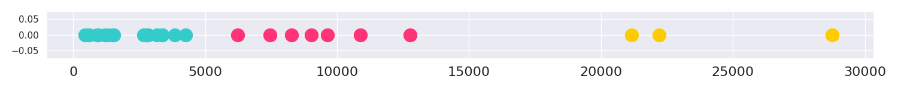

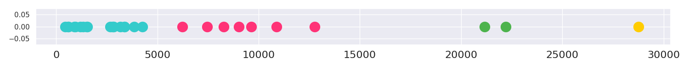

#### Wyszukiwanie cech charakterystycznych - drzewa decyzyjne
W celu znalezienia ogólnych zależności uzyskane grupowania zostały użyte jako etykiety 
w problemie klasyfikacji. Jako modele posłużyły drzewa decyzyjne przez wzgląd na fakt,
że dostarczają one informacji, które cechy dobrze rozgraniczają klasy. Aby odnaleźć najważniejsze
cechy rozgraniczające grupy państw uzyskane drzewa zostały poddane analizie. Poszukiwano takich,
które blisko korzenia posiadały cechy dobrze rozgraniczające klasy, np. wydzielające jedną.

Poniżej przedstawione zostały przykładowe wizualizacje uzyskanych drzew dla problemu z kolejno
dwoma, trzema i czterema etykietami.

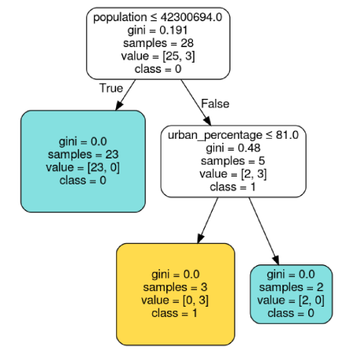 

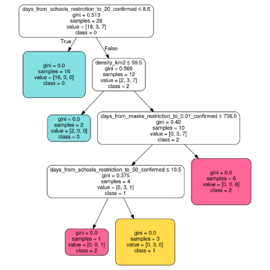

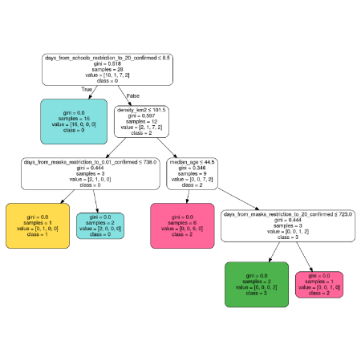

Na kolejnych grafikach można zobaczyć drzewo, które zostało uznane za dobry przykład wskazujący
na rozgraniczającą cechę oraz drzewo będące anty-przykładem.

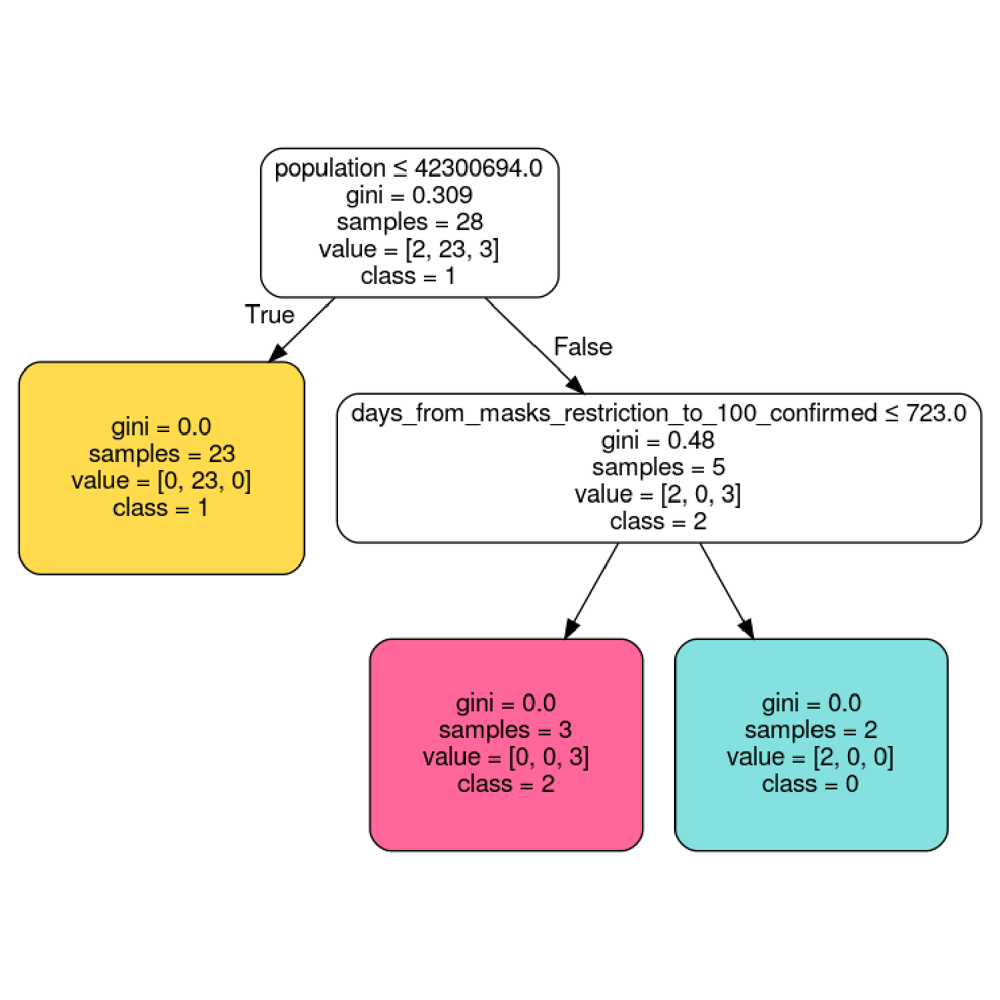

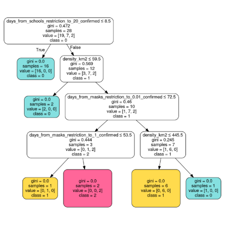

#### Podsumowanie metody

Z pierwszej przeprowadzonej analizy wynikało, że najważniejszym czynnikiem rozgraniczającym przebieg
pandemii w poszczególnych państwach jest wielkość populacji danego kraju. Jest to oczywiście cecha,
na którą nie sposób wpłynąć (nie można zmniejszyć populacji, tak jak np. zamknąć szkoły). Aby uniknąć
takich błędnych wniosków dane zostały poddane normalizacji (podział na milion mieszkańców).
Dalsze analizy pozwoliły jednak zrozumieć tylko tyle, że posiadane dane mogą być nierzetelne.

Przykładem może być tutaj liczba potwierdzonych przypadków, którą stwierdza się na podstawie
wykonanych testów. Warto jednak zwrócić uwagę, że w różnych krajach wykonywana jest czasem
znacząco różna ich liczba (uwzględniając wielkość populacji). Kolejną rzeczą jaka budzi wątpliwości
jest ich jakość.

Tabela poniżej przedstawia przykład państw z podobną liczbą przypadków, ale bardzo różną liczbą
mieszkańców i wykonanych testów. Pytanie jakie się nasuwa jest takie, czy istnieje rzetelna
miara na podstawie której możemy porównać państwa między sobą albo czy jesteśmy w stanie
oczacować różnice między deklarowaną liczbą przypadków a rzeczywistą.

| Kraj      | Liczba przypadków | Liczba mieszkańców | Liczba testów na milion |
|:----------|------------------:|-------------------:|------------------------:|
| Indonezja |            23 851 |        273 239 726 |                   1 019 |
| Kuwejt    |            23 267 |          4 264 228 |                  65 415 |
| Polska    |            22 473 |         37 850 425 |                  21 790 |
| Ukraina   |            21 905 |         43 757 273 |                   7 142 |

## Próba oszacowania rzeczywistych danych

W celu oszacowania rzeczywistej liczby przypadków bazowano na liczbie testów i liczbie zgonów.
Na tej podstawie zbudowano wiele modeli regresji. Błędy jakie uzyskano były jednak bardzo duże.

***Nie wiem co tu pisać***

Wyniki zostały przedstawione poniżej.

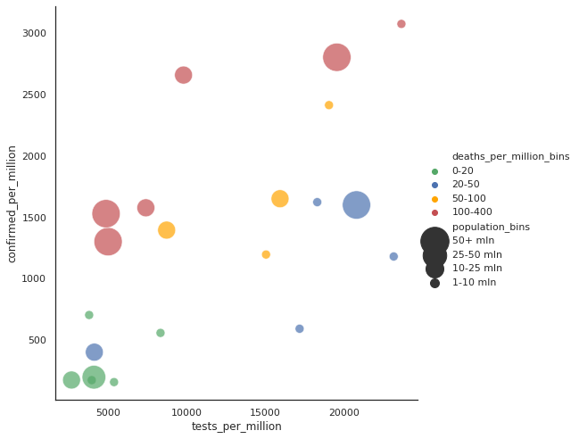

## Podsumowanie analiz na danych ilościowych

* Ocena rzeczywistej sytuacji w kraju jest problemem tak złożonym, że nie udało się znaleźć 
żadnej zależności pomiędzy liczbą testów a liczbą potwierdzonych przypadków.
* Nie udało się też znaleźć żadnego ground truth w postaci grupy krajów z dużą liczbą testów, 
ponieważ nawet dla 5 państw wyniki były niespójne.
* Na świecie różnie liczone są przypadki, sytuacji nie poprawia fakt, że liczba wykonywanych testów
jest niewystarczająca.
* Poważne wątpliwości co do możliwości znalezienia rzetelnych zależności, 
podczas analizy danych ilościowych

Przykładem rozbieżności w danych mogą być np. różnice w liczeniu testów przedstawione w tabeli poniżej.

| Liczba przeprowadzonych testów | Liczba przetestowanych osób | Liczba testów oraz liczba przetestowanych osób | Jednostka nieznana |
|----------|------------------|-------------------|------------------------|
|Belgia, Czechy, Finlandia, Niemcy, Węgry, Włochy, Łotwa, Polska, Rumunia, Rosja, Hiszpania, Szwajcaria|Dania, Grecja, Luksemburg, Norwegia, Portugalia, Serbia, Szwecja|Słowacja, Wielka Brytania|Austria, Estonia,  Francja, Islandia|

## Analiza wpływu decyzji rządowych - metoda procentowa

Wnioskiem jaki nasuwa się po wcześniejszych analizach jest to, że w zasadzie bardzo ciężko
lub jest niemożliwym porównywanie państw między sobą. W związku z tym znalezione zostało
inne rozwiązanie. Niezależnie od tego jak liczone są zgony i potwierdzone przypadki, 
to są one konsekwentnie liczone w danym kraju. 
Takie założenie o spójności krajów względem samych siebie zapoczątkowało nową analizę
zbliżoną metodyką do tej opartej na danych ilościowych.

### Zbiór cech
Zamiast sumarycznej liczby przypadków został zdefiniowany dzienny procentowy przyrost
na danych które zostały wcześniej wygładzone. Również tutaj występuje problem znalezienia
dnia wybuchu epidemii. Zdecydowano się na wyznaczenie początku pandemii jako 
,,pierwszy dzień, w którym dzienny procentowy wzrost zachorowań spadł poniżej **X%**".

Poniższe wykresy pokazują dla przykładu odpowiednio sumę wszystkich przypadków, dzienną liczbę nowych przypadków
oraz dzienny procentowy przyrost nowych przypadków.

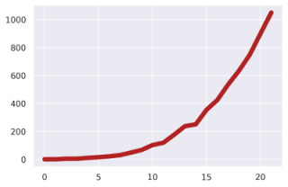 | 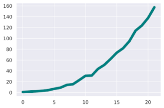
 
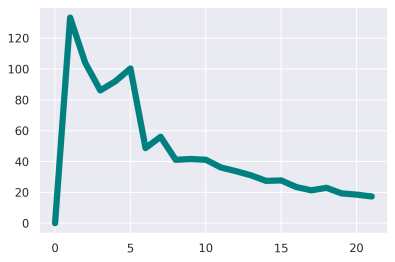

#### Cechy do klasteryzacji

W celu klasteryzacji państw poprzednią cechę - sumaryczną liczbę wszystkich przypadków po ***N*** dniach zastąpiono
czterema innymi cechami:

* Wartość procentowa po ***N*** dniach (średnia z ostatnich 3 dni)
* Średnia z całej krzywej
* Odchylenie z całej krzywej
* Procentowy przyrost przypadków po ***N*** dniach

Zwiększenie się liczby cech spowodowało większą liczbę klasteryzacji, ponieważ była ona wykonywana dla każdej z cech
z osobna. Każde z powstałych grupowań mówi coś innego - np. duże odchylenia standardowe mogą wskazywać na to, 
że kraj albo rzadko publikuje statystyki albo w wybranym oknie czasowym epidemia ma niestabilny przebieg.

***Wykresy ze slajdu 45???***

#### Cechy charakteryzujące państwo
Analogiczne do metody ilościowej z tym że, wartości liczbowe mówiące o przebiegu pandemii zostały zastąpione procentowymi.
Przykładowa cecha: ***,,liczba dni, które upłynęły od wprowadzenia decyzji rządowej do spadku do 20% przyrostu dziennego śmierci"***.

### Przykładowe wyniki
Przeprowadzona analiza pozwoliła stwierdzić, że **dużo drzew rozgraniczyło kraje po liczbie dni od zamknięcia szkół**.

Poniżej przedstawiony został przykład drzewa uzyskanego dla jednej z takich analiz. Pod uwagę brane było 30-dniowe okno
czasowe, którego punkt początkowy stanowił spadek do 20% przyrostu dziennego śmierci. Jak można zauważyć z poniższego
diagramu 22 z 24 krajów należących do jednej grupy od razu została rozgraniczona.

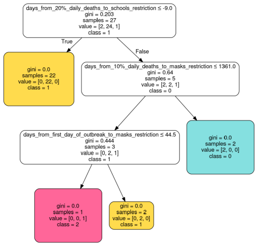

Po głębszej analizie przypadków okazało się, że kraje, które **lepiej** przechodziły epidemię **później** zamknęły szkoły.
Okazało się, że państwa z mniejszą śmiertelnością zamknęły szkoły średnio około miesiąc przed analizowanym oknem etapu epidemii, 
a pozostałe mniej więcej na 40 dni przed. Na przykładowej analizie widać też, że tylko 3 kraje należą do innych grup,
co daje małą korzyść z takiego grupowania.

Poniższe wykresy przedstawiają kolejno przebieg epidemii dla krajów w poszczególnych grupach, oraz przebieg z naniesioną
decyzją o zamknięciu szkół oraz dniem zerowym.

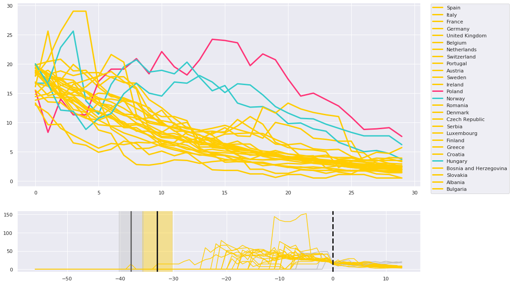

### Wnioski z analizy procentowej
* Pomimo bardzo prostych warunków grupowania cechy okazały się zbyt złożone.
* Odkryto zależności które nie mają większego sensu - im później zamknięto szkoły, tym mniejszy jest rozwój koronawirusa 
lub im mniejszy rozwój koronawirusa, tym później zamknięto szkoły.
* Ciężko jest znaleźć ogólne grupy krajów, ponieważ każde grupowanie określa inny moment/etap epidemii.
* Możliwe, że problem jest dużo bardziej złożony i dlatego z tak prostych grupowań niewiele mogło wynikać.

***Różnice kulturowe???***

## Analizy zewnętrzne

Ze względu na powszechność tematu powstaje dużo analiz próbujących pogrupować państwa, czy ocenić 
w jakim stopniu radzą sobie z koronawirusem. Ich przykładami mogą być:
* endcoronavirus.org
    * jak państwa radzą sobie z epidemią
    * grupowanie na podstawie kształtów krzywych przebiegu
* Cluster Analysis on Coronavirus Case Data
    * grupowanie na podstawie autorskich cech
    * możliwość zastosowania do przewidywania przebiegu pandemii
    
Powstają także analizy dotyczące testowania i rozstrzygnięcia liczby zgonów, np.:
* missing deaths - nytimes.com
* dysproporcje w liczbie testów w poszczególnych województwach w Polsce

### endcoronavirus.org
Analiza i krytyczne spojrzenie na informacje ze strony endcoronavirus.org zostały opisane [tutaj](./endcoronavirus).

## Podsumowanie

* Trudno wyznaczyć początek epidemii
* Różne pokrycie testami w różnych państwach
* Decyzje rządowe są ciężko porównywalne
* Dane nieznormalizowane mogą łatwo wprowadzać w błąd
* Testy są różnie liczone w różnych krajach i wątpliwa jest ich jakość
* Bardzo trudno wyznaczyć nawet kilka krajów, w których pandemia przebiega w ten sam sposób
* Państwa nierzetelnie podają informacje
* Między państwami występują nieuchwytne różnice kulturowe
* Państwa są wewnętrznie niezrównoważone

* Początkowy brak świadomości, że liczba potwierdzonych przypadków oraz liczba zgonów jest liczona tak bardzo różnie
* Nawet liczba testów może być liczona różnie
* Znaczny wpływ na przebieg epidemii ma moment pojawienia się pierwszego przypadku
* Ogrom różnych czynników sprawia, że bardzo ciężko jest przeprowadzić rzetelną analizę pod kątem jednego z nich
* **Brak wspólnego mianownika pozwalającego porównywać kraje**

