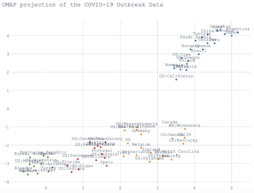

#### [Powrót](./)

### Cluster Analysis on Coronavirus Case Data

Analiza dokonująca grupowania państw na podstawie autorsko zdefiniowanych cech. Do klasteryzacji autorzy użyli metody
UMAP i HDBSCAN.
Można ją znaleźć [tutaj](https://github.com/ploner/coronavirus-clustering).

#### Grupowanie

Autorzy podobnie do przeprowadzonych przez nas analiz próbują jak najlepiej wyznaczyć początek pandemii
oraz jej punkt kulminacyjny. Do wyznaczenia momentu wybuchu stosują oni znormalizowaną cechę liczbową - liczba przypadków
większa niż 5 na milion mieszkańców. Jeśli chodzi o punkt kulminacyjny to (również analogicznie do nas) wygładzają najpierw
dane - tutaj rozmiar okna wynosi 7 dni. Pozwala to na eliminację losowych zaburzeń w danych spowodowanych np. opóźnieniem
w publikacji statystyk.

Do klasteryzacji stosują oni trzy lub pięć wyznaczonych przez siebie cech. Są to cechy dotyczące głównie początkowych
momentów pandemii. Trzy bazowe to:
* Liczba dni od początku epidemii do zwiększenia się liczby potwierdzonych przypadków dziesięciokrotnie.
* Tygodniowa liczba zgonów mierzona dwa tygodnie po wybuchu pandemii podzielona przez liczbę potwierdzonych przypadków
w początkowym tygodniu.
* Stosunek przyrostu liczby przypadków od początkowego do następującego po nim tygodnia oraz przyrostu liczby przypadków
od pierwszego do drugiego tygodnia po wybuchu epidemii.

Poniższy wykres przedstawia przykładowe wyniki klasteryzacji.

#### Podobieństwa do analiz przeprowadzonych przez nas
* Próba wyznaczenia początku epidemii w sposób inny niż stricte liczbowy
* Wygładzanie danych
* Użycie cech przyrostowych
* Normalizacja danych

#### Wątpliwości
* Brak krytycznego spojrzenia na dane
* Brak analizy opartej na aktywnych przypadkach
* Brak głębszej analizy wyników klasteryzacji, ich zastosowania

### Missing Deaths - nytimes.com

### Dysproporcja w testach w województwach w Polsce