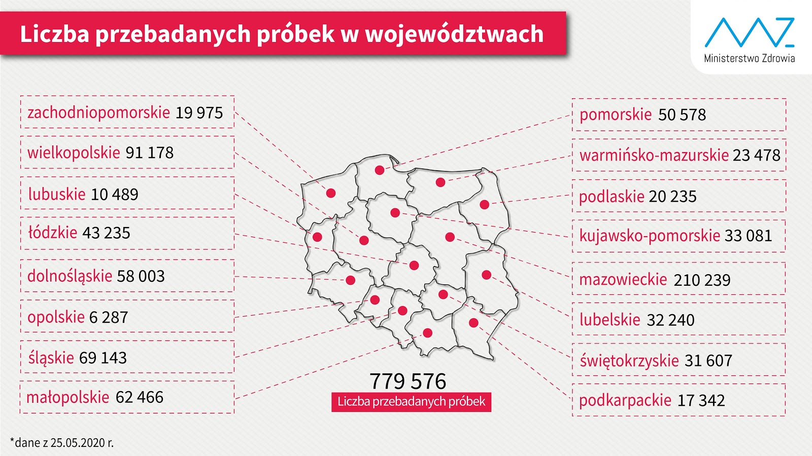

#### [Powrót](./)

### Cluster Analysis on Coronavirus Case Data

Analiza dokonująca grupowania państw na podstawie autorsko zdefiniowanych cech. Do klasteryzacji autorzy użyli metody
UMAP i HDBSCAN.
Można ją znaleźć [tutaj](https://github.com/ploner/coronavirus-clustering).

#### Grupowanie

Autorzy podobnie do przeprowadzonych przez nas analiz próbują jak najlepiej wyznaczyć początek pandemii
oraz jej punkt kulminacyjny. Do wyznaczenia momentu wybuchu stosują oni znormalizowaną cechę liczbową - liczba przypadków
większa niż 5 na milion mieszkańców. Jeśli chodzi o punkt kulminacyjny to (również analogicznie do nas) wygładzają najpierw
dane - tutaj rozmiar okna wynosi 7 dni. Pozwala to na eliminację losowych zaburzeń w danych spowodowanych np. opóźnieniem
w publikacji statystyk.

Do klasteryzacji stosują oni trzy lub pięć wyznaczonych przez siebie cech. Są to cechy dotyczące głównie początkowych
momentów pandemii. Trzy bazowe to:
* Liczba dni od początku epidemii do zwiększenia się liczby potwierdzonych przypadków dziesięciokrotnie.
* Tygodniowa liczba zgonów mierzona dwa tygodnie po wybuchu pandemii podzielona przez liczbę potwierdzonych przypadków
w początkowym tygodniu.
* Stosunek przyrostu liczby przypadków od początkowego do następującego po nim tygodnia oraz przyrostu liczby przypadków
od pierwszego do drugiego tygodnia po wybuchu epidemii.

Poniższy wykres przedstawia przykładowe wyniki klasteryzacji.

#### Podobieństwa do analiz przeprowadzonych przez nas
* Próba wyznaczenia początku epidemii w sposób inny niż stricte liczbowy
* Wygładzanie danych
* Użycie cech przyrostowych
* Normalizacja danych

#### Wątpliwości
* Brak krytycznego spojrzenia na dane
* Brak analizy opartej na aktywnych przypadkach
* Brak głębszej analizy wyników klasteryzacji, ich zastosowania

### Missing Deaths - nytimes.com

Bardzo ciekawa analiza pokazująca nieścisłości w danych opublikowana na stronie *nytimes.com* ([źródło](https://www.nytimes.com/interactive/2020/04/21/world/coronavirus-missing-deaths.html))
sprawdza jaka jest brakująca w statystykach liczba przypadków śmierci na COVID-19. W tym celu autorzy bazują na średniej
śmiertelności z poprzednich lat i porównują ją ze śmiertelnością dla poszczególnych państw w ostatnim czasie.
Następnie autorzy patrzą na przyrost śmierci i porównują go z oficjalnymi danymi o liczbie zgonów na COVID-19.
W momencie opublikowania autorzy twierdzili, że liczba brakujących zgonów wynosi aż 87 tysięcy 
(ponad dwa razy tyle co, wg oficjalnych statystyk, w Hiszpanii w tamtym czasie).

Poniżej przedstawione zostały wykresy które obrazują przyrost śmierci w stosunku do poprzednich lat dla wybranych państw.
Warto zauważyć, że nie wszystkie państwa w czasie epidemii notują duży wzrost. Istnieją wręcz takie państwa jak np.
Niemcy, które po odjęciu udokumentowanych zgonów na koronawirusa odnotowały spadek w stosunku do lat poprzednich.

 |  | 

Następująca tabela przedstawia skrót wykonanej przez *nytimes.com* analizy liczbowej 
(nie należy porównywać liczby zgonów między państwami, gdyż może się zdażyć że są podane dla różnych okresów).

| Państwo | % powyżej normy | Nadwyżka zgonów | Zgony na COVID-19 | Różnica |
| ------- | --------------- | --------------: | ----------------: | ------: |
| Hiszpania | 72% | 43,700 | 26,570 | 17,200 |
| U.S. | 23% | 63,700 | 47,430 | 16,300 |
| U.K. | 56% | 59,200 | 45,226 | 14,000 |
| Włochy | 49% | 24,600 | 13,710 | 10,900 |
| Francja | 34% | 24,300 | 22,708 | 1,500 |
| Szwecja | 32% | 4,300 | 3,594 | 700 |
| Niemcy | 3% | 3,000 | 5,737 | <0 |

Oczywiście taka analiza również nie przedstawia pełnycj informacji. Nie uwzględnia ona także różnych możliwych czynników
takich jak np. możliwy spadek liczby zgonów w wypadkach drogowych.

### Dysproporcja w testach w województwach w Polsce

W całej analizie mówiliśmy o niemożności porównania państw między sobą, o tym że występują znaczne dysproporcje w badaniu
choroby. Z przedstawionych w wielu źródłach informacji wynika, że badania w danym państwie, jak np. Polska, mogą być
wewnętrznie niespójne. Dobrym przykładem mogą być duże różnice w liczbie wykonanych testów w poszczególnych województwach
biorąc pod uwagę liczbę ich mieszkańców.

Poniższa infografika (stan na 25.05.2020 [źródło](https://www.medonet.pl/koronawirus/koronawirus-w-polsce,ile-testow-robi-sie-w-poszczegolnych-wojewodztwach--mz-publikuje-dane,artykul,85710032.html))
przedstawia liczbę wykonanych testów dla każdego z województw. Warto zwrócić uwagę na dwa najliczniej zamieszkiwane
województwa - mazowieckie oraz śląskie. Widoczna jest duża dysproporcja liczby testów między tymi województwami.
W województwie mazowieckim wykonano ponad trzy razy tyle testów co w śląskim (należy brać pod uwagę to, że są to dane przedstawione
po ,,wybuchu epidemii" na śląsku, wcześniej dysproporcje były jeszcze większe), gdzie liczba mieszkańców różni się o
700-800 tysięcy (5,3 mln w mazowieckim, 4,6 mln na śląsku). Gęstość zaludnienia na śląsku jest ok. 2,5 razy większa niż
w województwie mazowieckim. Oczywiście zagęszczenie ludności w samej Warszawie jest duże, jednak poza nią znacząco spada.
Śląsk natomiast można traktować jako konurbację, gdzie gęstość zaludnienia na większym obszarze jest stosunkowo duża.
Śląsk też posiada więcej dużych miast na prawach powiatu (19), w województwie mazowieckim jest to natomiast tylko 5 miast.
W obliczu tych faktów zdawać by się mogło że województwa te powinny być traktowane podobnie pod względem wykonywanych testów
na COVID-19. Tak jednak nie jest.

Warto zauważyć również, że liczba zachorowań w woj. śląskim jest ponad dwa razy wyższa niż w woj. mazowieckim.
Na podstawie dysproporcji w liczbie testów można jednak zakładać, że ta liczba jest dużo wyższa. Poniżej przedstawiono
mapę pokazującą liczbę zarażonych (stan na 27.05.2020 [źródło](https://tvn24.pl/polska/koronawirus-w-polsce-mapa-zakazen-wykres-ponad-24-tys-zachorowan-ponad-tysiac-osob-nie-zyje-2-czerwca-2020-4344739).

